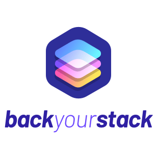

<p align="center">
  <a href="https://backyourstack.com/"></a>
</p>

[](https://travis-ci.org/opencollective/backyourstack)
[](https://slack.opencollective.org)
[](https://david-dm.org/opencollective/backyourstack)
[](https://greenkeeper.io/)

Discover the open source projects your organization is using that need financial support.

Our goal with BackYourStack is to make it easier for companies to identify the open source projects that they depend on that also need funding.

While we started with just node modules (as defined in package.json files) and with open source projects that are on Open Collective, we know that the open source community is much larger than that. That's why we would love to support more languages and platforms but for that, we need you!

Take a look at our public repository & [Contributing Guidelines](https://github.com/opencollective/backyourstack/blob/master/CONTRIBUTING.md) create or pick up issues and help us make open source more sustainable for everyone! 🙌

## Service

The official BackYourStack service is available from https://backyourstack.com/

## Development

### Prerequisites

#### Node.js

Make sure you have Node.js version >= 10. We recommend using [nvm](https://github.com/creationix/nvm): `nvm install`

#### GitHub API Keys

To allow authentication with GitHub, you'll need a set of keys for the GitHub API. You can get these keys by [registering a new OAuth application with GitHub](https://github.com/settings/applications/new). By default, the callback URL should be `http://localhost:3000/auth/github/callback`.

You will need the Client ID and Client Secret provided by GitHub after you register your application.

### Install

```
git clone https://github.com/opencollective/backyourstack.git
cd backyourstack
npm install
```

### Store Your GitHub API Keys

We use [dotenv](https://github.com/motdotla/dotenv) to store environment variables. In the root directory of the repository, rename `.env.template` to `.env` and add the Client ID and Client Secret generated when you registerd your GitHub application.

### Start

`npm run dev`

## Production

### Prerequisite

#### Now

BackYourStack is currently deployed with [Now](https://zeit.co/now). You will need to install [Now Desktop](https://github.com/zeit/now-desktop) or [Now CLI](https://github.com/zeit/now-cli).

Authenticate with:

`now login`

Switch to the Open Collective team account:

`now switch opencollective`

#### Secrets

Make sure that the following secrets are set (uses [now secret](https://zeit.co/docs/getting-started/secrets)):

| name                   | description                                                  |
| ---------------------- | ------------------------------------------------------------ |
| `github_client_id`     | Client id for the GitHub oAuth app                           |
| `github_client_secret` | Client secret for the GitHub oAuth app                       |
| `github_guest_token`   | GitHub access token used to process unauthenticated requests |

Eg: `now secret add github_client_id {value}`

### Deployment

First:

`now`

If everything is ok, finalize with:

`now alias`

## License

Back Your Stack is made available under the [MIT License](License)
